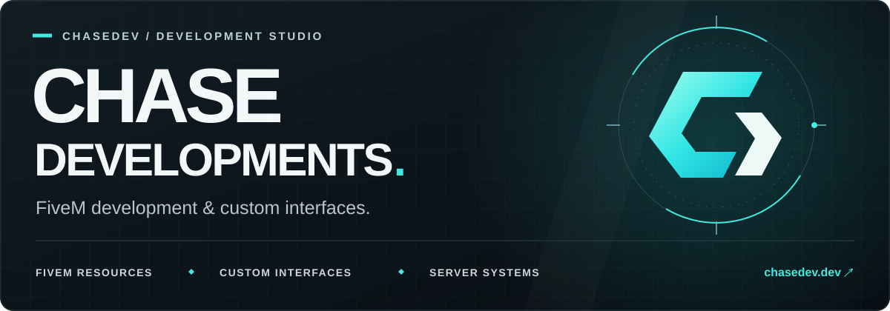
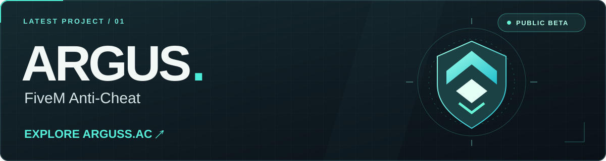
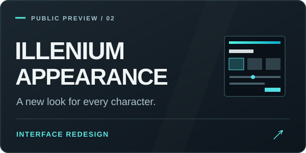
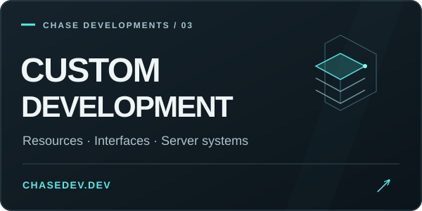

  

  
  
  

<h3 align="center">Built for the server you have in mind.</h3>

  I'm <strong>Chase</strong>, the developer behind <strong>Chase Developments</strong>. 
  I build custom FiveM resources, distinctive interfaces, and connected server systems. 
  From the first menu to the details players interact with every day.

  <strong>Custom scripting</strong> &nbsp; / &nbsp; <strong>Interface design</strong> &nbsp; / &nbsp; <strong>Framework integration</strong>

## Latest projects

  

**ARGUS** is a FiveM anti-cheat project with server and client checks, detection reporting, and a web management panel. The public beta is open for server owners to explore and share feedback.

**[Explore Arguss.ac →](https://arguss.ac)** &nbsp; · &nbsp; **[Read the docs](https://docs.arguss.ac)**

<table>
  <tr>
    <td width="50%" valign="top">
      
      
<strong>illenium appearance · UI redesign</strong>

      
Charcoal panels, crisp white typography, cyan highlights, and a focused layout for character customization.

      
<a href="https://github.com/chase5m/illenium-appearance"><strong>Explore the public preview →</strong></a>

    </td>
    <td width="50%" valign="top">
      
      
<strong>Your next server project</strong>

      
Custom Lua resources, interface redesigns, framework integrations, and connected gameplay systems shaped around your server.

      
<a href="https://discord.gg/dwSWngcanj"><strong>Discuss a project →</strong></a>

    </td>
  </tr>
</table>

  
  
  

## The toolbox

  
  
  
  
  
  

FiveM development across <strong>QBCore</strong>, <strong>Qbox</strong>, <strong>ESX</strong>, and <strong>Chase Core</strong>.

## On GitHub

  

<h3 align="center">Have a server in mind? Let's build it.</h3>

  Bring your ideas, references, and the details that make your community different. 
  <a href="https://discord.gg/dwSWngcanj"><strong>Start a conversation on Discord</strong></a> &nbsp; · &nbsp; <a href="https://chasedev.dev"><strong>Visit chasedev.dev</strong></a>

CHASE DEVELOPMENTS &nbsp; / &nbsp; chasedev

